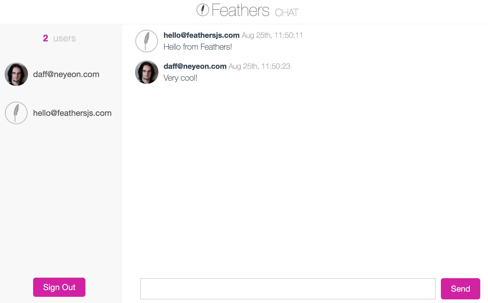

# Getting ready


Alright then! Let's learn what Feathers is all about. First we'll have a look at what we are going to do in this guide, what you should already know and what needs to be installed to use Feathers.

## What we will do

In this guide we will get a [quick start](./starting.md) by creating our first simple Feathers REST and real-time API and a website to use it from scratch. Then we will learn about the [Feathers CLI](./generator.md) and the core concepts of [services](./services.md), [hooks](./hooks.md) and [authentication](./authentication.md) by building a chat application that allows users to sign up, log in (including with GitHub) and send and receive messages in real-time. It will look like this:



You can find the final version at

:::: tabs :options="{ useUrlFragment: false }"
::: tab "JavaScript"
The [feathersjs/feathers-chat](https://github.com/feathersjs/feathers-chat) repository
:::
::: tab "TypeScript"
The [feathersjs/feathers-chat-ts](https://github.com/feathersjs/feathers-chat-ts) repository
:::
::::

## Prerequisites

Feathers works with NodeJS v10.0.0 and later. We recommend using the latest available version from the [NodeJS website](https://nodejs.org/en/). On MacOS and other Unix systems the [Node Version Manager](https://github.com/creationix/nvm) is a good way to quickly install the latest version of NodeJS and keep it up to date.

After successful installation, the `node` and `npm` commands should be available on the terminal and show something similar when running the following commands:

```
$ node --version
v12.0.0
```

```
$ npm --version
6.9.0
```

> **Note:** Running NodeJS and npm should not require admin or root privileges.

Feathers does work in the browser and supports IE 10 and up. The browser examples used in the guides will however only work in the most recent versions of Chrome, Firefox, Safari and Edge.

## What you should know

In order to get the most out of this guide you should have reasonable JavaScript experience using [ES6](http://es6-features.org/) and later as well as [async/await](https://developer.mozilla.org/en-US/docs/Web/JavaScript/Reference/Statements/async_function) and some experience with NodeJS and the JavaScript features it supports like the [module system](https://nodejs.org/api/modules.html). You can read more about `async/await` in [this blog post](https://blog.risingstack.com/mastering-async-await-in-nodejs/). Some familiarity with HTTP and [REST APIs](https://en.wikipedia.org/wiki/Representational_state_transfer) as well as websockets is also helpful but not necessary.

Feathers works standalone but also provides [an integration](../../api/express.md) with [Express](http://expressjs.com/). This guide does not require any in-depth knowledge of Express but some experience with Express can be helpful in the future.

## What we won't cover

Although Feathers works with many databases, this guide will only use [NeDB](https://github.com/louischatriot/nedb/) which is a file-system based database so there is no need to run a database server. More information about specific databases can be found in the [databases API](../../api/databases/adapters.md).

This guide will also only focus on Feathers core functionality. Once you are finished with the guide, have a look at the [ecosystem page](https://github.com/feathersjs/awesome-feathersjs) for more advanced plugins.

## What's next?

All set up and good to go? Let's [install Feathers and create our first app](./starting.md).
